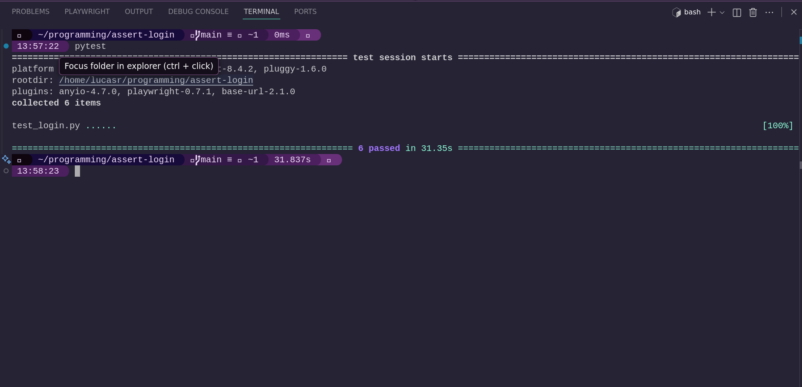

<h1 align="center"> ✨ AUTOMATION PROJECT 🔍 </h1>

## 📖 introduction 

Hallo Semua! Namaku Lucas ini adalah project otomisasi pertama saya. Pada kesempatan kali ini saya melakukan pengujian secara otomisasi menggunakan <a href=""> Playwright </a> sebagai framework dan <a href="" >Python</a> sebagai bahasa pemogramman.  

Ini adalah proyek pengujian fungsionalitas fitur Login pada situs <a href="https://the-internet.herokuapp.com/login"> https://the-internet.herokuapp.com/login</a>.

## 🔬 dokumentasi 

 - ###### [Test Case](https://docs.google.com/spreadsheets/d/1RM2PC2sJhfQSAhn1RIG0guujf2BGf11TjeYcAPeu8zI/edit?usp=sharing) 
- ##### After execute code 

--- 

## 🙏 Penutup & Ucapan Terima Kasih 

Project ini merupakan langkah awal dalam perjalanan saya mendalami dunia automation testing. Saya berharap ini dapat bermanfaat bagi para pemula lain yang sedang dalam perjalanan yang sama. 

    "The only difference between a 'bug' and a 'feature' is whether the QA team knows about it." 

    — Anonymous 
     